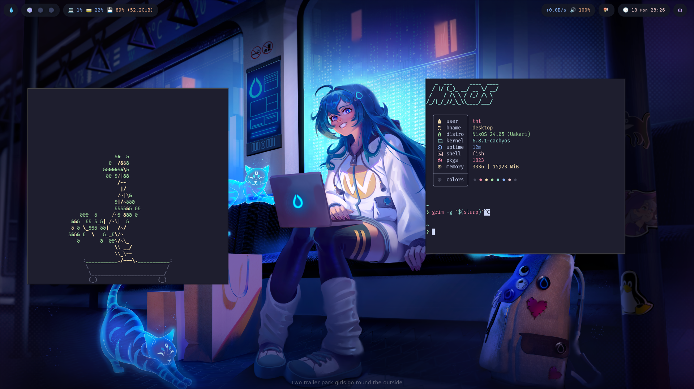

# Dots: NixOS Dotfiles

Welcome to my NixOS dotfiles repository, where I meticulously manage configurations for (almost) every device on my network—excluding my phone and router (though I'm actively working on incorporating them too).

This is my personal opinion on what the ultimate distro looks like, or atleast as close as i could get it

## Features

### Rust

I try to use Rust-based alternatives whenever possible. This flake utilizes the following replacements:

- `ls` ➔ `eza`
- `cat` ➔ `bat`
- `cp` ➔ `xcp`
- `rm` ➔ `rmz`
- `coreutils` ➔ `uutils`
